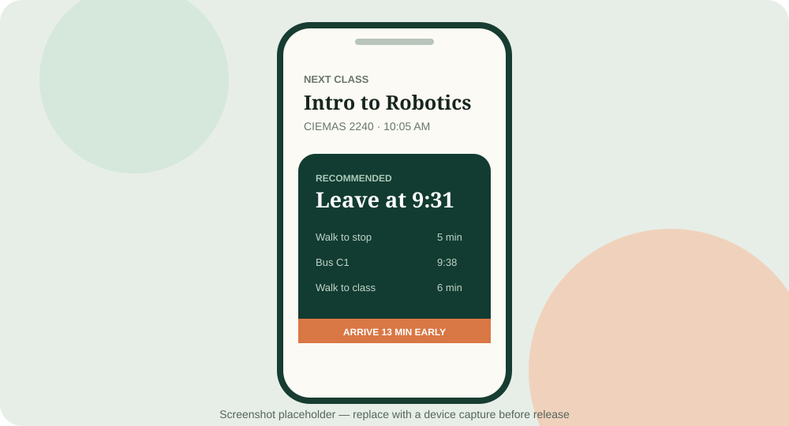

# Campus Commute Assistant

> Never miss class because you picked the wrong campus bus.

Campus Commute Assistant works backward from the next class on your calendar. It combines the class
time, a locally cached campus GTFS schedule, the user's saved home line and boarding stop, each
course's saved arrival stop, optional walking estimates, and a configurable safety buffer to
recommend when to leave for a matching bus.

The v0.1 adapter targets Duke University. The routing and data modules are campus-neutral so another
school can be added without forking the core engine.



## What works in v0.1

- Import or replace `.ics` calendars and expand recurring class events for the coming year. A
  successful replacement swaps the saved events atomically while retaining route and stop choices.
- Normalize common Duke room labels and resolve six seed buildings: CIEMAS, Hudson Hall, Gross Hall,
  LSRC, Physics, and French Family Science Center.
- Download and parse `stops`, `routes`, `trips`, `stop_times`, `calendar`, `calendar_dates`, optional
  `frequencies`, and optional `shapes` from a GTFS zip.
- Keep the last good GTFS archive in IndexedDB, refresh stale data on startup, check periodically,
  and support manual refresh.
- Save one default line and home boarding stop, bind an arrival stop to each course/location, then
  rank only matching trips by the latest safe leave time.
- Apply walking time at both ends, campus timezone rules, service exceptions, and GTFS times after
  midnight.
- Evaluate fixed-schedule and headway trips together without rewriting feed `route_id` or `trip_id`.
  Inexact headways reserve up to one full headway of waiting and are labeled low-confidence.
- Return a clear no-departure state instead of silently switching routes or stops.
- Persist settings and imported classes locally with Capacitor Preferences.
- Select Home with an explicit OpenStreetMap address search, a map pin, coordinates, or the
  device's current location.
- Switch the application UI and commute notifications between English and Simplified Chinese.
- Optionally reuse one arrival-stop binding for different rooms normalized to the same building;
  this is experimental, off by default, and does not overwrite exact course/location bindings.
- Open Duke's official TransLoc vehicle map in a near-full-screen experimental iframe, with a
  direct official-site fallback.
- Replace and reschedule Android local notifications when a recommendation changes.
- Review every remaining class and its matching commute in a grouped, next-7-days plan.
- Add four Android home-screen widgets: next commute (2×2), today (4×2), today + tomorrow (4×4),
  and next 7 days (4×5). Widgets use the same saved static-schedule results as the app.
- Open Android's battery optimization management screen from Settings when device power management
  delays reminders or widget refreshes.
- Build as a Vite web app or a Capacitor Android app without an application server.

v0.1 is a timetable matcher, not a general journey planner. It does not search nearby stops,
substitute routes, or calculate transfers. A Home pin adds the walk to the saved boarding stop. A
recognized building adds the final walk from the class's saved arrival stop; an unknown building
does not block matching and is treated as the arrival stop itself.

## Stack

React 19, TypeScript, Vite, Capacitor 7, Capacitor Preferences, IndexedDB, Leaflet with OpenStreetMap,
`ical.js`, `fflate`, Vitest, ESLint, and Prettier.

## Run locally

Requirements: Node.js 20 or newer.

```bash
npm install
npm run dev
```

The app is then available at the URL printed by Vite. The first GTFS download needs internet
access; subsequent routing works from the cached archive. Map tiles and address search need
connectivity unless cached, but the saved Home location and coordinate fields remain usable
offline.

Quality commands:

```bash
npm run format:check
npm run lint
npm run typecheck
npm test
npm run build
npm run gtfs:validate
```

## Android build

Install Android Studio, Android SDK 35, and JDK 21. The native project is committed under `android/`.

```bash
npm install
npm run android:sync
npm run android:open
```

Choose **Build > Build APK(s)** in Android Studio, or build a debug APK from a terminal:

```bash
cd android
./gradlew assembleDebug
```

The debug APK is written to `android/app/build/outputs/apk/debug/app-debug.apk`. Android 13 and newer
ask for notification permission when the first future commute reminder is scheduled. The manifest
declares coarse and fine location access, but runtime permission is requested only after **Use
current location** is pressed; searching an address or dropping a pin never requests GPS access.

Four widgets appear under **Campus Commute Assistant** in the Android widget picker. Open the app
after changing a calendar, stop, language, buffer, or GTFS data so it can publish a fresh local
next-7-days snapshot. Widgets re-render the saved snapshot at most every 30 minutes and discard
classes once their start time has passed; they do not download GTFS or run a second routing engine.

The battery button opens Android's standard battery-optimization list. It does not silently exempt
the app and the manifest intentionally does not request `REQUEST_IGNORE_BATTERY_OPTIMIZATIONS`,
which keeps the behavior explicit and suitable for ordinary Play-distributed applications.

## Local-first data flow

```text
.ics file -> recurring classes -> local Preferences
                                      |
GTFS zip -> IndexedDB -> parsed feed -+-> exact route/stop matcher -> UI + notification
                                      |
saved home stop + per-class stop -----+
                                      |
                                      +-> 7-day local snapshot -> Android widgets
```

Preferences is used for small settings and course data. The binary GTFS archive is kept in
IndexedDB because Capacitor Preferences is not designed for large values. Refresh errors never
delete the last usable feed.

Home address search uses the public OpenStreetMap Nominatim endpoint for this small MVP. It runs
only on an explicit Search submission (never as autocomplete), limits and rate-limits results,
caches repeat queries for the current session, and shows OpenStreetMap attribution. Set
`VITE_NOMINATIM_URL` at build time to use another compatible endpoint. A larger public deployment
should use a hosted provider or its own Nominatim instance rather than relying on the community
server.

## Campus adapter architecture

```text
src/
  core/
    calendar/       # iCalendar expansion and stable class binding keys
    gtfs/           # parsing, service dates, cache, downloads and stop selection
    locations/      # building normalization and walking estimates
    routing/        # selected route/stop timetable matcher
    realtime/       # provider contract
    notifications/  # native reminder scheduling
    storage/        # local settings and classes
  campuses/
    duke/
      config.ts
      buildings.ts
      realtime.ts
```

See [docs/ARCHITECTURE.md](docs/ARCHITECTURE.md) for the boundaries and routing scope.

### Add another school

1. Create `src/campuses/<school>/`.
2. Export a `CampusAdapter` with an IANA timezone, public GTFS URL, refresh interval, and building
   aliases/coordinates.
3. Supply a `RealtimeProvider`. It may report `available = false`; static routing must still work.
4. Register the adapter in `src/campuses/index.ts` and add source notes and tests.

No core routing branch should inspect a campus ID.

## Duke data sources

Static schedules use Duke's current TransLoc-hosted GTFS download:

- [Duke/TransLoc GTFS zip](https://duke.transloc.com/Secure/Admin/Reports/GTFSDownload.aspx)
- [Duke Parking & Transportation bus routes](https://parking.duke.edu/buses-vans/)
- [Official LL Counter Clockwise 2026–2027 timetable](https://parking.duke.edu/buses-vans/ll-lasalle-loop-counter-clockwise/)
- [Transitland's Duke feed record](https://www.transit.land/feeds/f-dnrug-duke~nc~us)

The GTFS URL was verified on 2026-08-27 to return an `application/zip` response with CORS enabled.
The development server also provides a same-origin compatibility proxy. Native Android requests use
Capacitor's HTTP bridge.

Duke uses TransLoc for rider-facing live vehicle tracking. During the same review, no current,
documented, stable, keyless third-party TransLoc API or Duke GTFS-Realtime feed could be verified.
The old TransLoc OpenAPI references are historical and are not treated as a production contract.
Consequently `DukeRealtimeProvider` is intentionally unavailable and returns no fabricated data; no
private endpoint, scraped token, or credential is embedded. A future adapter should only be enabled
after Duke or TransLoc publishes a supported contract and its CORS/authentication terms are known.

The UI separately offers an experimental embed of the official
[Duke TransLoc live map](https://duke.transloc.com/). This is a third-party visual page for viewing
vehicle GPS positions only: the app does not inspect its DOM, inject JavaScript, copy cookies, read
ETA predictions, or send its contents into the routing engine. The saved static GTFS and official
schedule supplement remain the sole inputs to commute recommendations. The external TransLoc link
is always available, and is promoted automatically if the iframe reports an error or takes too long
to load. Browser security prevents a parent page from detecting every possible cross-origin frame
failure, so the external link remains visible even after a nominal iframe load.

As checked on 2026-08-27, the TransLoc page was HTTPS and its main response did not include
`X-Frame-Options` or a CSP `frame-ancestors` restriction. That is not a permanent contract; if the
provider changes its policy, the app will not attempt to bypass it. Android does not add TransLoc to
Capacitor `allowNavigation`, does not enable mixed HTTP content, and does not grant the embedded
frame geolocation permission.

`npm run gtfs:validate` audits the current raw feed and prints every C1 and LL-family variant with
its exact source IDs, trip IDs, frequency windows, and sample first-stop departures. As of the last
verification, the raw feed defines `TL-13 / LLCCW` and `TL-19 / LLCCWN` but supplies no trips for
either route. Duke's official route page does publish complete major-stop times for both variants.

The Duke adapter therefore applies a small bundled supplement only when those raw routes still have
no trips. It preserves `TL-13` and `TL-19`, creates clearly namespaced `duke-official:*` trip and
trip IDs, reuses TransLoc's raw stop IDs, and cites the source in the route picker and recommendation
card. Daytime LLCCW is the published exact 24-minute cycle from 07:12 through 17:36. The complete
current TransLoc stop order is included; un-timed intermediate stops are interpolated between Duke's
published checkpoints and displayed as approximate/low-confidence times. Evening departures are
stored explicitly because the official table has an irregular first gap, but only its published
timed stops are exposed because the current TransLoc night stop order conflicts with that table. The
supplement covers weekdays from
2026-08-10 through 2027-05-09 and must be reviewed when Duke publishes the next schedule. It does
not infer holiday or special-event exceptions absent from the route page. If TransLoc begins
providing trips for a variant, its raw GTFS data automatically wins and the supplement is skipped.

Building coordinates are a small seed set based on public Duke and OpenStreetMap records, not a
complete campus GIS dataset. Contributions should cite the source and favor entrances over broad
parcel centroids.

## Tests

The suite covers quoted GTFS CSV, recurring ICS events, seven-day window filtering, timezone conversion, multiple feasible
buses, a last bus that misses the deadline, buffer behavior, weekend calendars,
`calendar_dates` additions/removals, after-midnight stop times, no feasible transit, unknown
buildings, selected stop order, and refusal to substitute an unselected route.

GitHub Actions runs formatting, lint, typecheck, tests, the production web build, Capacitor sync, and
an Android debug APK build.

## Roadmap

- v0.2: verified realtime arrivals/vehicle positions, delay-aware rerouting, and stale-data warnings.
- v0.2: optional system calendar access and richer Duke building coverage.
- Later: saved route/stop presets, bike timing, more campus adapters, and accessible commute
  preferences.

## Privacy

Schedules, language, stop bindings, and saved Home coordinates remain on the device. The app sends
GTFS requests to the campus feed host, map-tile requests to OpenStreetMap, and only user-submitted
address searches to OpenStreetMap Nominatim. Duke's TransLoc site is contacted only after the user
opens the live-map page. It has no analytics or application backend. Do not enter confidential
information in the address search.

## License

[MIT](LICENSE)
